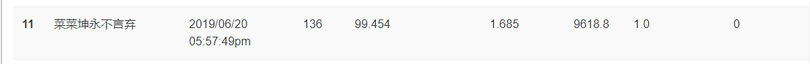
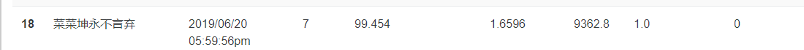
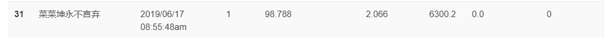

# DNA 拼接 Project 报告

常朝坤			16307130139

## 1. 简述

本项目的目标是将基因片段拼接成长序列。采用的基础算法是`De Brujin`(下称`DBG`) 算法，并在算法的基础上加入错误处理、覆盖率低等问题。

## 2. 算法描述

### DBG 图构建

1. 读取`read`片段，并将每一个`read`及其反向互补序列切成长度为k的小片段`(kmer)`，得到`kmer`的不重复集合`(set)`，记为`S`。

2. 将`S`中每一个`kmer`视作一个节点，如果两个`kmer`之间有`k-1`长度的连续交叠`(overlap)`，则在图中这两个节点间连一条有向边，方向为后缀-->前缀（如若A的后缀与B的前缀匹配，则有一条A-->B的边）。

如[图 1]所示为一个由DBG算法构建的图：

*图1*

### DBG 图分析

对于一个DNA序列，每一个位置有四种取值`ATCG`(不考虑空位`N`)，则一个kmer的取值空间大小$$D=4^k$$。而一个长度为N的DNA序列切割成的reads所产生的kmer总数 $$M=N-k+1$$。
$$
每一个Kmer都不同的概率P=\frac{D(D-1)\dots(D-M+1)}{D^M} \\
因为如果k较大(k>20)，D >> M，导致P较小，所以构建的DBG图中一般会有分支。\\
但是，在概率的支撑下，我们可以计算两个kmer重复的概率P_{same} = \frac{1}{D} \\
P_{same}的值也很小，所以在不出错的情况下，分支不会很多。
$$

### DBG 图压缩

基于上述的概率分析，我们可以得出以下两个结论：

- DBG图中含有分支
- 但是分支数量不多，大部分节点都是单入单出的（即入度和出度皆为1）

所以构建的DBG图可以进行压缩，将连续的单入单出节点合并为一个，如[图 2]所示。

*图*2

### 路径搜索

路径搜索方法在本实验中尤为重要，搜索的方法有多种，其区别主要在于分支的选择策略。

### 图可视化

## 3. 特殊处理

### 错误类型及产生机制

### 错误处理

### 低覆盖率处理

## 4. 结果与分析

data 1

data 2

data 3

data 4

## 5. 总结

## 6. 附录

### 6.1 参考文献

### 6.2 声明

### 6.3 程序运行指南