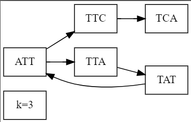
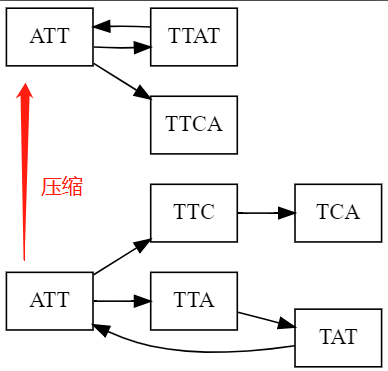
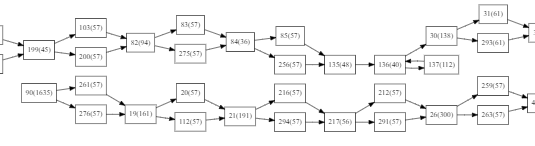
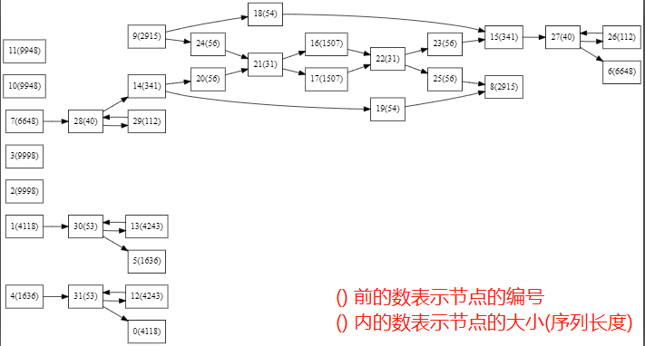
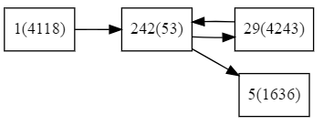
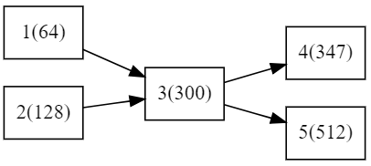
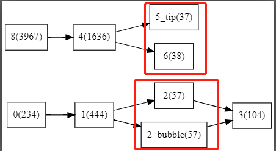
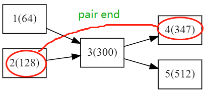
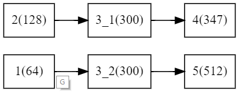

# 宏基因组组装 Project 报告

常朝坤			16307130139

## 1. 简述

本项目的目标是将基因片段拼接成长序列。采用的基础算法是`De Brujin`(下称`DBG`) 算法，并在算法的基础上加入错误处理等问题。

## 2. 算法描述

### 2.1 DBG 图构建

1. 读取`read`片段，并将每一个`read`及其反向互补序列切成长度为k的小片段`(kmer)`，得到`kmer`的不重复集合`(set)`，记为`S`。

2. 将`S`中每一个`kmer`视作一个节点，如果两个`kmer`之间有`k-1`长度的连续交叠`(overlap)`，则在图中这两个节点间连一条有向边，方向为后缀-->前缀（如若A的后缀与B的前缀匹配，则有一条A-->B的边）。

如[图 1]所示为一个由DBG算法构建的图：

| 图 1                                         | 备注  |
| -------------------------------------------- | ----- |
|  | k = 3 |

### 2.2 DBG 图分析

对于一个DNA序列，每一个位置有四种取值`ATCG`(不考虑空位`N`)，则一个kmer的取值空间大小$$D=4^k$$。而一个长度为N的DNA序列切割成的reads所产生的kmer总数 $$M=N-k+1$$。
$$
每一个Kmer都不同的概率P=\frac{D(D-1)\dots(D-M+1)}{D^M} \\
因为如果k较大(k>20)，D >> M，导致P较小，所以构建的DBG图中一般会有分支。\\
但是，在概率的支撑下，我们可以计算两个kmer重复的概率P_{same} = \frac{1}{D} \\
P_{same}的值也很小，所以在不出错的情况下，分支不会很多。
$$
另外，由于重复kmer的可能，所以DBG图有可能会有环。

### 2.3 DBG 图压缩

基于上述的概率分析，我们可以得出以下两个结论：

- DBG图中含有分支
- 但是分支数量不多，大部分节点都是单入单出的（即入度和出度皆为1）

所以构建的DBG图可以进行压缩，将连续的单入单出节点合并为一个，如[图 2]所示。

| 图 2                                         | 备注                                   |
| -------------------------------------------- | -------------------------------------- |
|  | 下侧图即为图1，上侧图为图1的压缩结果。 |

### 2.4 图可视化

为了便于观察建图的状况以及基因间的关系，本实验对构建的图进行了可视化。由于原图过大，所以可视化是在图压缩后的可视化，采用的方法时生成`graphviz`格式的.dot文件，使用`graphviz`软件画图，画图的逻辑详见源码的`show_graph`函数。如下图左所示为data1 可视化的结果的一个子图，右图为将部分二分叉点合并的结果（方便观察整体结构）。

| 图 3-1 可视化子图                            | 图 3-2 整体结构                              |
| -------------------------------------------- | -------------------------------------------- |
|  |  |

由于对每个read都取了其反向互补序列，所以所有的链都是重复一次的。从可视化的结果可以看出，原来的5条DNA序列有两条很相似，他们仅有部分位置的碱基不同（导致了大量长度相同且序列仅相差为1的分支）。

### 2.5 图的分支

路径搜索方法在本实验中尤为重要，搜索的方法有多种，其区别主要在于分支的选择策略。

#### 分支产生机制

分支的产生机制有如下三个：

1. 单条DNA序列出现重复的Kmer（记为A类分支）
2. 两条（或多条）不同的DNA序列出现了相同的Kmer（记为B类分支）
3. 单条DNA序列的某些位置发生了错误（缺失，增添与变异）（记为C类分支）

第一种机制在DBG图中的表现形式为一个**circle**，如 [图4-1] 所示，形成了两个节点组成的环。

第二种机制在DBG图中的表现形式为一个**hub**，即n入n出的节点，如[图4-2]所示。

第三种机制在DBG图中的表现形式为一个**bubble/tip**，如[图4-3]所示。

| 图 4-1                                       | 图 4-2                                       | 图 4-3                                       |
| -------------------------------------------- | -------------------------------------------- | -------------------------------------------- |
|  |  |  |

#### 分支处理策略

##### A类分支

A类分支的处理较为简单，在压缩后的图上，如果某一个节点的子节点也包括了该节点，即形成了两节点环，则将该子节点拼接入父节点，而后删除该子节点即可，如图4-1中的处理结果路径应为`1-->242-->29-->242-->5`。该步骤也可以直接在图压缩过程处理掉。下述所讲述的方法都是针对B类和C类分支的策略。

##### B类分支

B类分支的处理可以利用`Pair-End`信息或`long sequence`信息处理，二者都提供了一个更严苛的序列连续性限制，但是相对而言，`long sequence`的错误率较高，所以本实验中采用了前者。如果一个hub的两端的某两个节点组成了一个Pair-End，便可以利用此信息将hub解螺旋。如下图所示:

| 解螺旋前                                     | 解螺旋后                                     |
| -------------------------------------------- | -------------------------------------------- |
|  |  |

需要注意的是很多hub可以生成的四条链长度都不足500，所以无法判断pair end的存在性，所以需要迭代的解螺旋，由可以解螺旋的部分迭代地向四周扩散。

##### C类分支

如果错误发生在序列中间，则会产生bubble，如果发生在序列末尾，则会产生tip，二者的共同特点都是频数较低，所以可以通过频数过滤处理掉这些错误。在建好图后，如果某一个连续的kmer序列的频次相同且都低于阈值（实验中设为2），则将这些kmer删掉，然后重新建图。

这种方法在data4中会遇到问题，由于data4的覆盖率比较低，所以这种方法会删除掉很多不该删除的节点。对于这种情况，可以考虑使用pair end信息或长序列进行处理，方法类似于B类分支的处理方法。

### 2.6 路径搜索

将图的分支处理掉后，还是会有一些处理不掉的分支，所以还需要进行路径的搜索。由于处理后的分支不多，所以可以考虑将所有可能的路径都搜索一遍，而后选取最长的5个互异的结果。另一种处理方法是贪心的策略，每次遇到分支都选取长度较长的分支。实验结果表明，前者的结果要更好一些。

### 2.7 再拼接技术

DBG算法的输出再data3/4上会遇到一些段序列，可以考虑对这些段序列利用前缀后缀匹配的关系进行再拼接，得到更长的序列。

## 3. 算法结果

data 1


data 2


data 3


data 4


## 4. 附录

### 4.1 参考文献

[1]. https://academic.oup.com/nar/article/45/6/e43/2638393?sid=4c8c5d1a-1fe3-4702-a19e-1848b4c261d5 

[2]. http://www.sohu.com/a/202971027_278730

[3]. https://www.cnblogs.com/leezx/p/5590159.html

[4]. https://alexbowe.com/succinct-debruijn-graphs/

### 4.2 程序运行指南

```bash
python run.py 	--data_dir ../data/data1 --result_name answer.fasta \
				--file_type short \
				--k 29 --limit 2 \
```

最新的重构代码详见github项目 

[src]: git@github.com:fdcck/DE-NOVO.git	"github repository"